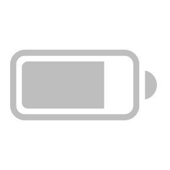

  

<h1 align="center">ChromeOS Battery</h1>
<h2 align="center">Custom battery level notification for Chrome OS</h2>

### Features
- Set a custom battery level that you want to trigger a notification for it
- If you always ignore the low battery notifications (just like me😀), this extension also provides an option to show a fullscreen warning so that you can't ignore it anymore :)
#### Coming soon
<i>Might take forever to implement if nobody request it :)</i>
- Custom notification icon
- Custom message (fullscreen warning/notification)

### So, how to install this?
- Download [archive](https://github.com/supechicken/ChromeOS-Battery/archive/refs/heads/main.zip) of this repository and unzip it
- Unpack the downloaded `.zip` file by:
  - Right click the zip file in the file manager and select <kbd>Extract All</kbd>
  - Optionally delete the `.zip` file
- Go to [`chrome://extensions`](chrome://extensions) and enable `Developer Mode` (don't confuse with the **Chrome OS developer mode**, they are not the same thing)
- Click <kbd>Pack Extension</kbd>, click <kbd>Browse</kbd> under <kbd>Extension Root Directory</kbd>, then click on the folder named `ChromeOS-Battery-main`, and click <kbd>Open</kbd>
- Click <kbd>Pack Extension</kbd>, then click <kbd>OK</kbd>
- Open the file manager, go to Downloads and drag the `.crx` file into the `chrome://extensions` window.
- Click <kbd>Add Extension</kbd>
- Optionally delete the generated `.crx` packaged file and `.pem` key file

### Why not uploading it to Chrome Web Store?
Uploading to Chrome Web Store requires a credit/debit card to pay a one-time registration fee, and it only accepts credit/debit card only. The issue is I don't have any credit/debit card (I am only 14) :/

### License
This project is released under [GNU General Public License (version 3 or later)](http://www.gnu.org/licenses/gpl.txt)
The icon of this project is created by [Jemis Mali](https://iconscout.com/contributors/jemismali), released under [Creative Commons 4 Attribution - NonCommercial](https://creativecommons.org/licenses/by-nc/4.0/)

